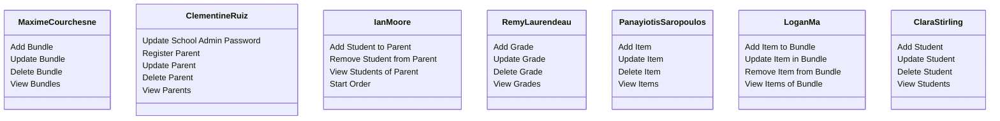
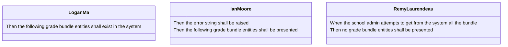

# :triangular_ruler::books: ECSE223 CoolSupplies Project: Team N

_(Edit this file as needed, then remove this sentence)._

## Project Overview

_Provide a one-sentence overview of your project here._

For more information about the CoolSupplies application, please consult the [wiki](../../wiki).

## Team Members

| Name          | GitHub username |
| ------------- | --------------- |
| Team Member A | MaximeCourchesne |
| Team Member B | ...             |
| Team Member C | ...             |
| Team Member D | ...             |
| Team Member E | ...             |
| Team Member F | ...             |

# Iteration 2

## Part 1: Assignment of Feature Sets to Team Members

**1.clone our group's repo: ecse223-group-project-p9**

Make sure that you create your branch from the **common-base** branch and not from the **main** branch that is usually default.

For readability purposes, please branch name that is clear and contains your name

See diagram:

### Features to implement
1. Update school admin password; register parent, update it, and delete it (from the list of parents)
2. Add student, update it (including its grade), and delete it (from the list of students)
3. Add item, update it, and delete it (from the list of items)
4. Add bundle, update it (including its grade), and delete it (from the list of bundles)
5. Add item to bundle, update it, and remove item from bundle (i.e., remove it from the list of items
of the bundle)
1. Add student to parent and remove student from parent (i.e., remove it from the list of students
of the parent); start an order (note: adding items/bundles to the order and removing them is out
of scope for this iteration)
1. Add grade, update it, and delete it (from the list of grades)

You will need to your controler function that you will find here: 
ecse223-group-project-p9\src\main\java\ca\mcgill\ecse\coolsupplies\controller\CoolSuppliesFeatureSet<your_function_number>Controller.java

#### Responsibilities for part 1

## Part 2: Gherkin Step Definitions
Our team has been assigned with creating gerking step definitions for **DeleteGradeBundle and GetGradeBundle**
The controller's feature that these tests are meant to test will be implemented by Maxime **before October 10th**.

Then, our team will implement these tests in the following way:

#### Responsibilities part 2

